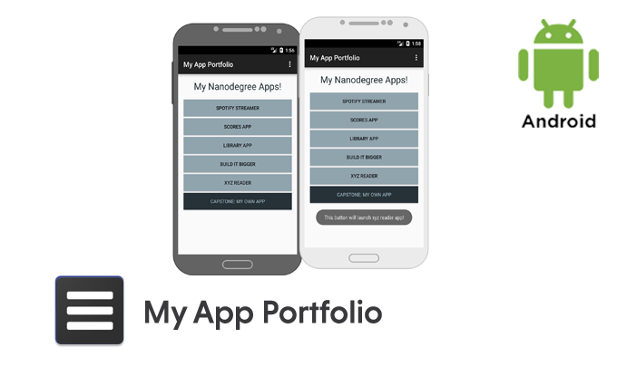

# Udacity App Portfolio



## Project description

Portfolio app (Project 0) for Udacity Android Developer Nanodegree. This app provides no other purpose than to showcase apps will be developed in the program.

[Screenshots](Screenshots/)


 ## Udacity Nanodegree App Portfolio Project

 

  # License - Apache License, Version 2.0

  ```
  # (C) Copyright 2016 by Marek Hakala <hakala.marek@gmail.com>
  # Licensed under the Apache License, Version 2.0 (the "License");
  # you may not use this file except in compliance with the License.
  # You may obtain a copy of the License at
  #
  # http://www.apache.org/licenses/LICENSE-2.0
  #
  # Unless required by applicable law or agreed to in writing, software
  # distributed under the License is distributed on an "AS IS" BASIS,
  # WITHOUT WARRANTIES OR CONDITIONS OF ANY KIND, either express or implied.
  # See the License for the specific language governing permissions and
  #    limitations under the License.
  ```
